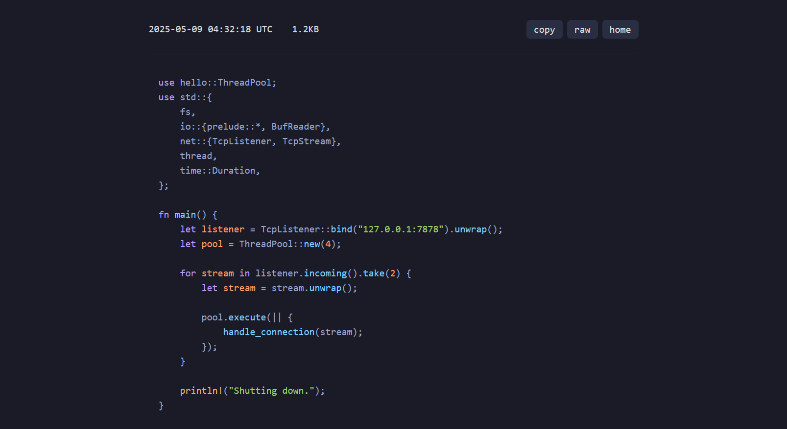

# Ctrl+V
### A minimal [Pastebin](https://pastebin.com/) clone built with Rust and Axum



## Features

- Create pastes via a simple web interface
- View pastes with syntax highlighting using [highlight.js](https://highlightjs.org/)
- Copy paste content to clipboard with a single click
- View raw paste content
- Mnemonic url generated from BIP39 wordlist (e.g., "apple.orange")
- Temporary by default with a 24 expiration

## Prerequisites

- Rust and Cargo installed (https://rustup.rs/)

## Development
 - Run the application with
    ```bash
    cargo run
    ```

 - Open your browser and navigate to: http://localhost:3000